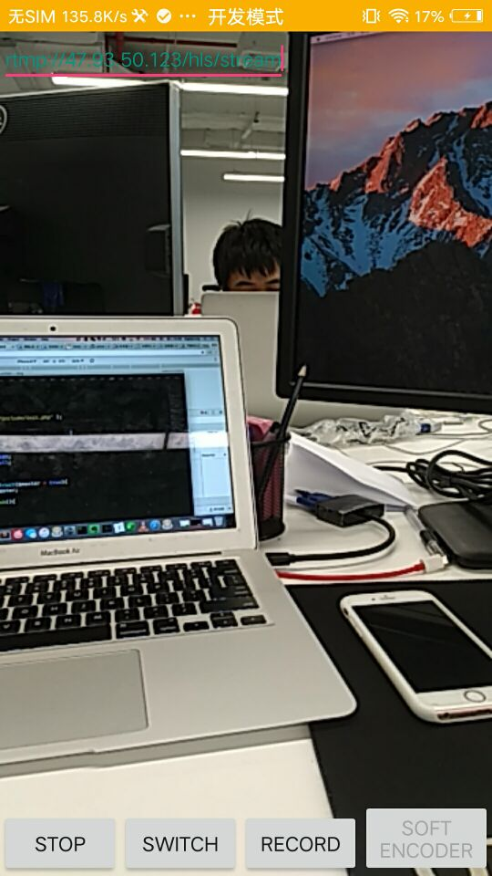
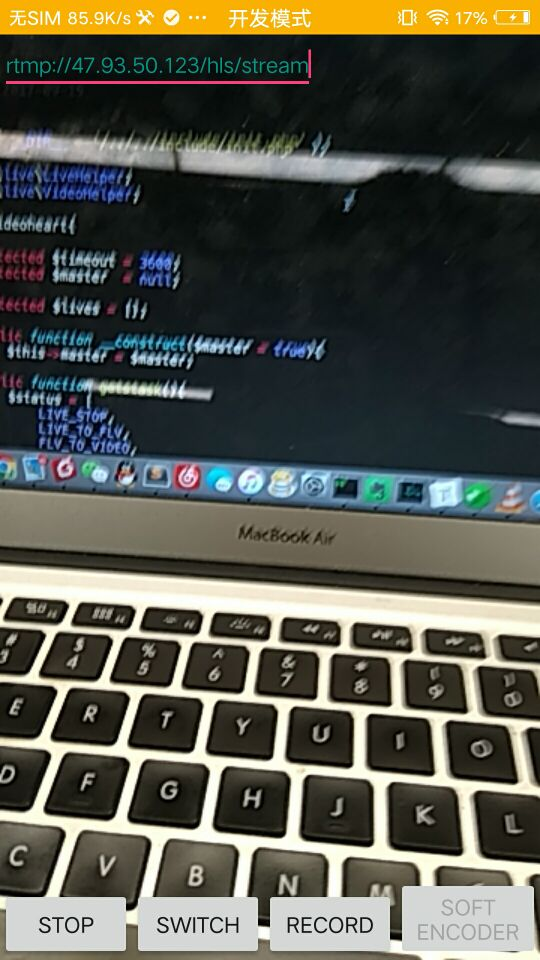
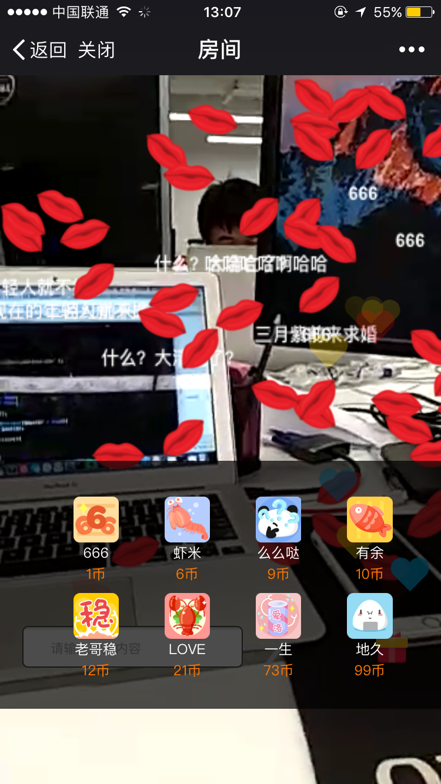
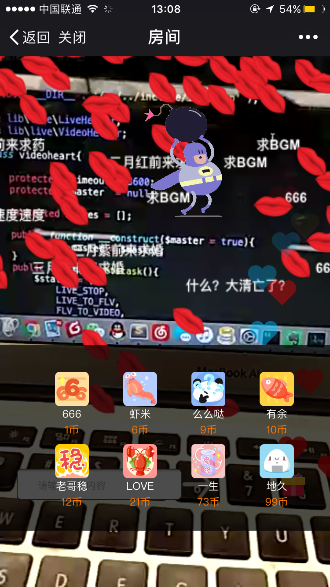

# 微信直播系统方案
> 利用第三方推流工具向流服务器推流，由Nginx的rtmp模块转为HLS可通过video标签播放的资源在微信公众号播放。从而达到位置直播的目的。


## 分布式数据库搭建
> 应对数据库的并发，配备两台mysql服务
> 一台负责写（master）
> 一台负责读（slave）
> 实现数据读写分离，应对异常时主从切换
> 具体的安装不再赘述 


```
array(
            'dbhost' => '127.0.0.1',
            'dbport' => '3306',
            'dbname' => 'live',
            'dbuser' => 'live',
            'dbpassword' => '1234live!@#$',
            'unix_socket' => '/data/mysql3306/mysql3306.sock',
        ),
        array(
            'dbhost' => '127.0.0.1',
            'dbport' => '3307',
            'dbname' => 'live',
            'dbuser' => 'live',
            'dbpassword' => '1234live!@#$',
            'unix_socket' => '/data/mysql3307/mysql3307.sock',
        ), 
```

## 分布式Redis搭建
> 同mysql服务一台写一台读


```
 array(
            'ip' => "127.0.0.1",
            'port' => '6379',
            'timeout' => 5,
            'auth' => '1234live!@#$',
        ),
        array(
            'ip' => "127.0.0.1",
            'port' => '6380',
            'timeout' => 5,
            'auth' => '1234live!@#$',
        ),
        
```
 

## 分布式Memcached（伪分布式）
> Memcached分布式其实是伪分布式，Memcached本身并不能达到分布式的效果，可以通过程序哈希出一个地址，通过地址将数据落在不同的Memcached服务器。

```
		 array(
            '127.0.0.1',
            '11211',
        ),
        array(
            '127.0.0.1',
            '11212',
        ),
        
```

## 直播流服务
> 推流服务器主要通过Nginx的[nginx-rtmp-module](https://github.com/arut/nginx-rtmp-module)模块来实现

* 编译模块
```
./configure --add-module=/path/to/nginx-rtmp-module --with-http_ssl_module --with-debug
```
* 配置
rtmp流配置

```
rtmp{
        server{ 
                listen 1935;
                chunk_size      4000;    
                application hls{
                        live on;
                        hls on; 
                        hls_path        /data/rtmp/hls;
                        hls_fragment 5s;
                }       
        }       
}
```

hls服务配置 端口给8080 web端口80

```
server{
       listen 8080;
        server_name huanpenghls.com;
        root /data/rtmp;
        location        /hls{   
                #server HLS fragments
                types{  
                        text/html html htm;
                        #application/vnd.apple.mpegurl m3u8;
                        application/x-mpegurl m3u8;
                        video/mp2t ts;
                }       
                root /data/rtmp;
                index index.html;
                expires -1;
        }       
}

```

## 消息服务
> 基于Workeman的消息系统


* 房间消息
* 弹幕消息
* 礼物消息

服务监听房间频道收到消息后给房间每个用户发送消息，
客户端收到socket消息做对应展示。redis做消息队列。


## 微信公众号
> 开通开发模式

## 前端展示
> 利用第三方推流工具 Android Yasea或者ios的易推流工具
> 

### 推流端

图一：
图二：


### 微信端
图一：
图二：
图三：
图四：
